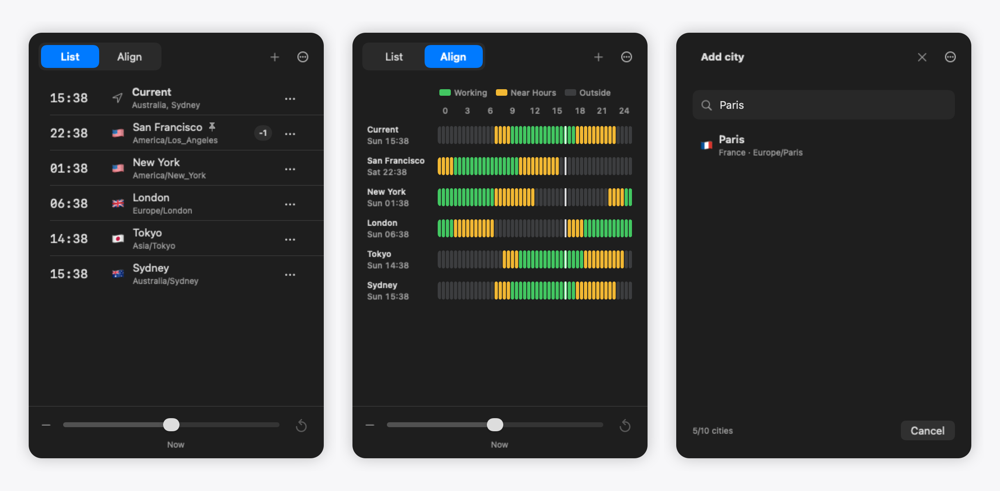

# TimezoneBar



TimezoneBar is a simple macOS menu bar app for checking times across cities and finding good meeting hours.

- View local times in a list.
- Compare working hours at a glance.
- Add the cities you care about.

Green means working hours, yellow means near working hours, and gray means outside working hours.

## Install

1. Download the latest Apple Silicon build from [GitHub Releases](https://github.com/crypblizz8/timezone-bar/releases/latest).
2. Unzip it.
3. Move `TimezoneBar.app` to Applications and open it.

## Develop

```sh
swift run
```

Build the app bundle:

```sh
./Scripts/make-app.sh
open .build/TimezoneBar.app
```
